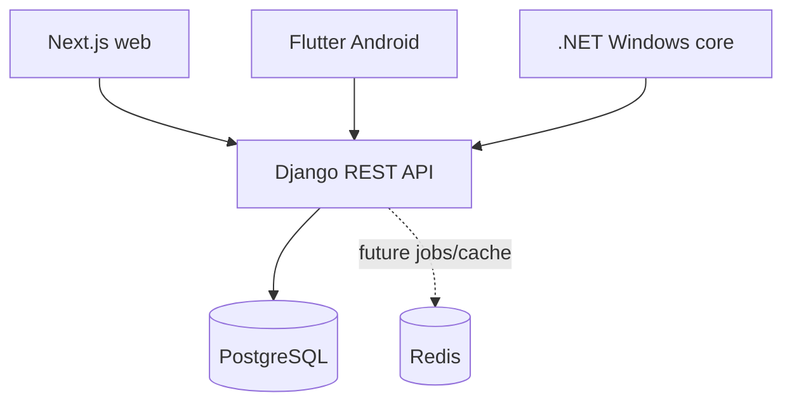
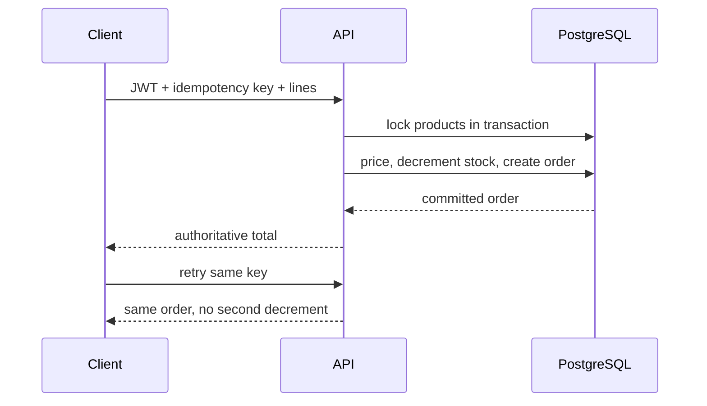

# Platform architecture

The case study separates a Django/DRF system of record from channel-specific clients.

## Boundaries

- The API owns identity, catalogue, authoritative prices, inventory, and order transactions.
- Web is an online typed client; Android and Windows expose durable offline-operation boundaries.
- PostgreSQL stores transactional state. Redis is provisioned but no worker integration is claimed.
- Docker Compose is the reproducible local deployment, not an internet-production prescription.

## Checkout sequence

## Privacy boundary

All public implementation and fixtures are newly written. The repository excludes production source,
customer records, credentials, internal URLs, financial rules, licensing logic, private screenshots,
and proprietary assets.
